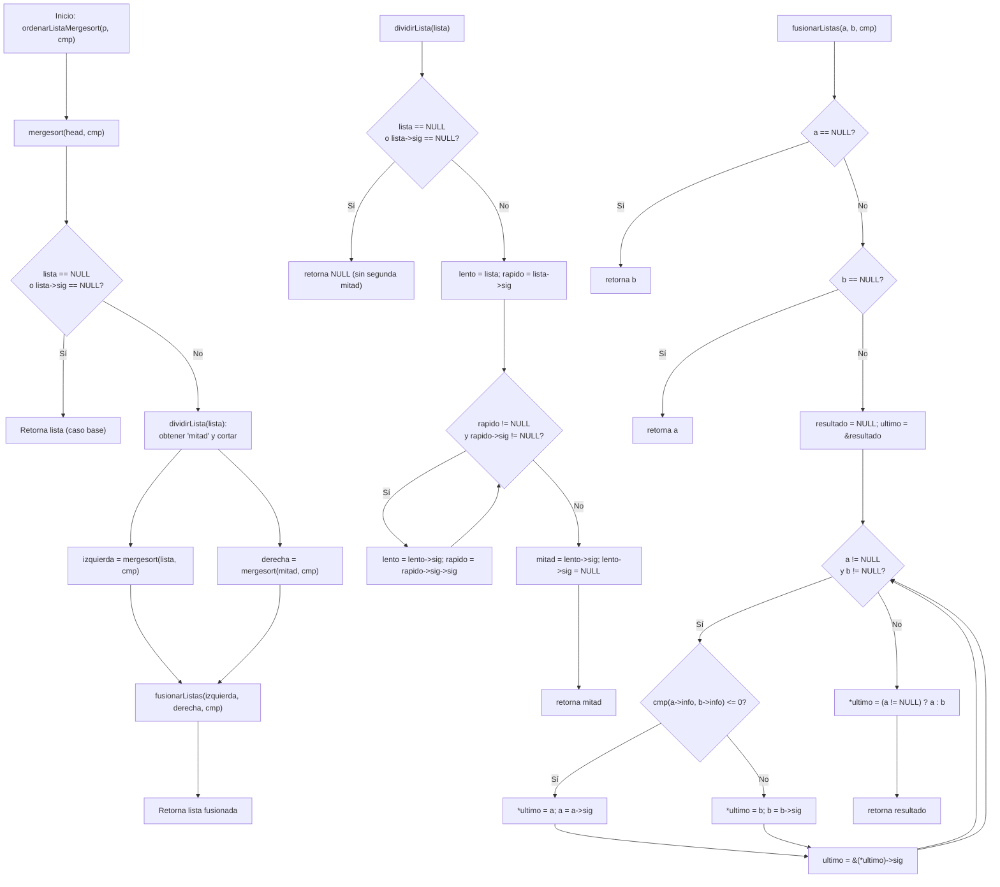

```mermaid
flowchart TD
    %% --- Flujo general de mergesort ---
    A["Inicio: ordenarListaMergesort(p, cmp)"] --> B["mergesort(head, cmp)"]
    B --> C{"lista == NULL<br/>o lista->sig == NULL?"}
    C -- "Sí" --> D["Retorna lista (caso base)"]
    C -- "No" --> E["dividirLista(lista):<br/>obtener 'mitad' y cortar"]
    E --> F["izquierda = mergesort(lista, cmp)"]
    E --> G["derecha = mergesort(mitad, cmp)"]
    F --> H["fusionarListas(izquierda, derecha, cmp)"]
    G --> H
    H --> I["Retorna lista fusionada"]

    %% --- División en mitades (liebre y tortuga) ---
    A2["dividirLista(lista)"] --> B2{"lista == NULL<br/>o lista->sig == NULL?"}
    B2 -- "Sí" --> C2["retorna NULL (sin segunda mitad)"]
    B2 -- "No" --> D2["lento = lista; rapido = lista->sig"]
    D2 --> E2{"rapido != NULL<br/>y rapido->sig != NULL?"}
    E2 -- "Sí" --> F2["lento = lento->sig; rapido = rapido->sig->sig"] --> E2
    E2 -- "No" --> G2["mitad = lento->sig; lento->sig = NULL"]
    G2 --> H2["retorna mitad"]

    %% --- Fusión estable de dos listas ordenadas ---
    A3["fusionarListas(a, b, cmp)"] --> B3{"a == NULL?"}
    B3 -- "Sí" --> C3["retorna b"]
    B3 -- "No" --> D3{"b == NULL?"}
    D3 -- "Sí" --> E3["retorna a"]
    D3 -- "No" --> F3["resultado = NULL; ultimo = &resultado"]
    F3 --> G3{"a != NULL<br/>y b != NULL?"}
    G3 -- "Sí" --> H3{"cmp(a->info, b->info) <= 0?"}
    H3 -- "Sí" --> I3["*ultimo = a; a = a->sig"] --> K3["ultimo = &(*ultimo)->sig"] --> G3
    H3 -- "No" --> J3["*ultimo = b; b = b->sig"] --> K3 --> G3
    G3 -- "No" --> L3["*ultimo = (a != NULL) ? a : b"]
    L3 --> M3["retorna resultado"]
```